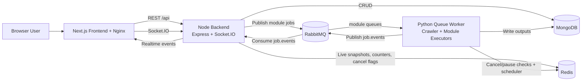

# Complete Infrastructure Analysis

Date: 16 March 2026
Scope: Entire workspace runtime stack (frontend, Node backend, Python workers, infra compose files)

---

## 1) System Architecture

### Architecture style
- Modular distributed architecture with clear runtime separation:
  - Frontend web app: Next.js (ref-frontend)
  - API/orchestration backend: Node.js + Express (nnode-backend)
  - Async execution backend: Python workers (npy-backend)
  - Infra dependencies: MongoDB, Redis, RabbitMQ
- Not a strict microservice mesh, but a service-split async system.

### How components interact
- Frontend sends authenticated API calls to Node backend (cookies included).
- Node backend handles auth, project/session/job lifecycle, and persists canonical business state.
- Node publishes async jobs to RabbitMQ module-specific queues.
- Python workers consume queues, run crawls/AI tasks, write analysis data to MongoDB, and publish lifecycle/progress events.
- Node consumes job.events, updates statuses, stores live state in Redis, and pushes real-time updates via Socket.IO.

### Request flow (client -> database)
1. Browser -> Nginx/Next.js container
2. Browser -> /api/* -> Node backend
3. Node -> MongoDB for sync entities (users/projects/sessions/jobs)
4. Node -> RabbitMQ (enqueue async jobs)
5. Python worker -> execute -> MongoDB result collections
6. Python worker -> RabbitMQ job.events
7. Node job-events consumer -> MongoDB status reconciliation + Redis live snapshot
8. Node Socket.IO -> frontend live progress UI

---

## 2) Database Layer

### Technologies in use
- Primary DB: MongoDB (NoSQL)
- SQL/ORM (Prisma/Postgres) appears in old docs/log history only; active runtime code uses MongoDB driver and PyMongo.

### Main collections/entities
- Core business/auth:
  - users, admins, projects, sessions, jobs
- Crawl/SEO outputs:
  - pages, links, sitemaps, fields, job_summaries, schemas, content_metrics, prompt_tracking, performance_audits
- AI/module outputs:
  - aeo_analysis, module_e, module_f, serp_results

### Data access patterns
- Node backend:
  - Repository/service/controller pattern with mongodb driver
  - Aggregations with $lookup for session/project views
  - Pagination and projection for large result lists
- Python backend:
  - Central MongoManager singleton
  - Upsert-heavy write model for idempotent module/crawl updates
  - Bulk write for crawler throughput

### Query optimization patterns
- Explicit index creation in Python startup:
  - jobId, url, (jobId,url), unique indexes for module outputs
- Bulk upserts in crawler pipelines
- Selective field projection and sorted pagination in Node API endpoints

---

## 3) Caching Layer

### Redis usage
- Live job runtime state (status/logs/pages count/step state)
- Cancellation and pause flags for worker control
- Distributed rate-limiting counters
- Scrapy-Redis distributed scheduler and dedupe state

### What is cached
- Ephemeral runtime state for active/recent jobs
- Real-time counters used by UI progress components
- Rate-limit windows per IP/user
- Crawl queue fingerprints/requests (Scrapy-Redis)

### Invalidation strategy
- TTL-based expiration (commonly 24h for job live keys)
- Explicit cleanup on job/session deletion
- Reset of previous state on JOB_STARTED

### Redis architecture pattern
- Redis as:
  - state store (job/session live snapshots)
  - distributed limiter backend
  - crawler scheduler backend
- Not used as classic app session store for auth; auth is JWT cookie-based.

### Additional cache
- Python orchestrator/checkpoint uses file-based JSONL cache in data/cache (prototype cache layer separate from Redis).

---

## 4) Message Queue / Event System

### Queue technology
- RabbitMQ with isolated per-module exchanges/queues and DLQ/DLX setup.

### Producers and consumers
- Producers:
  - Node QueueService publishes module jobs (crawler/schema/module_a/module_c/module_d/module_e/module_f)
  - Python EventPublisher publishes job lifecycle/progress events to topic exchange job.events
- Consumers:
  - Python queue worker consumes module queues and executes jobs
  - Node job-events consumer consumes job.events and reconciles runtime state

### Event flow
1. Node creates job and publishes module message
2. Python consumes, executes, emits progress + terminal events
3. Node consumer stores events to Redis snapshot model, updates MongoDB job/session statuses, emits Socket.IO

### Queue usage patterns
- Queue isolation by job category
- Durable queues, persistent messages, DLQ routing
- Manual ack/nack strategy:
  - success -> ack
  - retryable -> nack requeue
  - non-retryable -> nack drop to DLQ

---

## 5) External Libraries and Frameworks

### Node backend (major)
- express: HTTP API
- mongodb: database access
- amqplib: RabbitMQ
- ioredis: Redis
- socket.io: real-time updates
- jsonwebtoken + bcrypt: auth primitives
- helmet + cors + express-rate-limit: security and traffic controls
- zod: input/env validation
- winston: logging

### Python backend (major)
- pika: RabbitMQ
- redis: Redis client
- pymongo: MongoDB client
- scrapy + scrapy-redis: crawling and distributed queueing
- beautifulsoup4/lxml/readability-lxml: extraction/parsing
- openai/anthropic/google-generativeai: LLM providers
- boto3: object storage (S3-compatible)
- fastapi/uvicorn present in dependencies (worker-centric runtime currently dominant)

### Frontend (major)
- next/react: web app framework
- @reduxjs/toolkit + RTK Query: API state/cache
- socket.io-client: live event subscription
- recharts and UI libs (Radix ecosystem): visualization/UI

---

## 6) Infrastructure & DevOps

### Docker/container setup
- Service Dockerfiles for Node, Python, and frontend
- Frontend container includes Nginx reverse proxy and direct static asset serving strategy

### Environment configuration
- Base compose expects external Redis/RabbitMQ endpoints
- Local compose overlay provides Redis/RabbitMQ containers for development
- Server env template documents production variables and secrets

### Deployment setup
- Current deployment model is Docker Compose-driven
- Production safety guard in both backends blocks local infra URLs in production unless explicitly overridden

### CI/CD
- No repository-level CI pipeline configs found (.github workflows not present)

---

## 7) Performance & Scalability

### Existing scalability strategy
- Async offload of heavy jobs to Python workers via RabbitMQ
- Queue isolation reduces cross-module contention
- Redis-backed global rate limits support multi-instance Node scaling
- Python execution uses thread pool + spawned subprocess for crawler isolation (Twisted-safe)

### Potential bottlenecks
- Single job.events consumer path in Node can become central pressure point
- Aggregation-heavy session/project reads can become expensive with growth
- Event publisher intentionally drops events when local queue is full during broker outage (memory safety tradeoff)

### Background workers and async processing
- Fully event-driven async model for crawl/analysis lifecycle
- Socket + Redis snapshots provide near-real-time UI feedback

---

## 8) Security Layer

### Authentication/authorization
- JWT-based auth
- httpOnly cookie tokens:
  - access_token (user)
  - admin_token (admin)
- Role checks in middleware (admin and role-based gates)

### Token/session handling
- Token verification server-side in API middleware
- Cookie policy:
  - secure in production
  - sameSite strict in production

### Secure communication and hardening
- Helmet security headers
- CORS allowlist from env
- Redis-backed rate limiting (global/credential/session/write)
- Password hashing with bcrypt
- Input validation with Zod

### Notable gap
- Python worker queue ingress does not show a request-level API-key auth gate in queue path (trusted network/model assumed).

---

## 9) Observability

### Logging
- Node: Winston with console + file outputs
- Python: centralized logging configuration with suppression of noisy crawler/twisted logs
- Detailed lifecycle logs in queue/consumer/crawler paths

### Monitoring and error tracking
- No built-in Prometheus/OpenTelemetry/Sentry instrumentation found in backend runtime
- Frontend includes Vercel analytics dependencies, but backend operational telemetry stack is minimal

---

## 10) Final Summary

This project runs as a modular async platform:
- Next.js frontend handles user experience and live progress display.
- Node backend is the control plane for auth, business entities, job orchestration, and live event fan-out.
- Python backend is the execution plane for crawls and AI-heavy analysis.
- MongoDB persists durable business and analysis data.
- RabbitMQ handles asynchronous module job routing and event propagation.
- Redis powers live status snapshots, cancellation control, crawler scheduler state, and distributed rate limits.

### Diagram-style connection map

---

## Key Operational Notes
- Local development: base compose + local infra overlay.
- Production: base compose only with external/managed Redis and RabbitMQ endpoints.
- The admin-dashboard-design folder is primarily a design/static admin UI package and is not the core runtime integration path of the production flow above.
